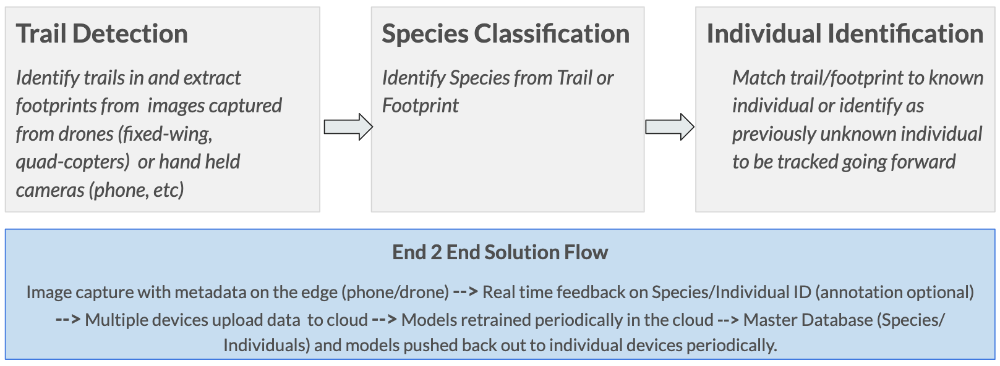
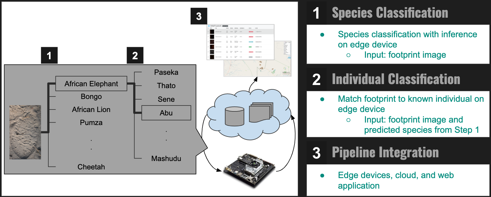
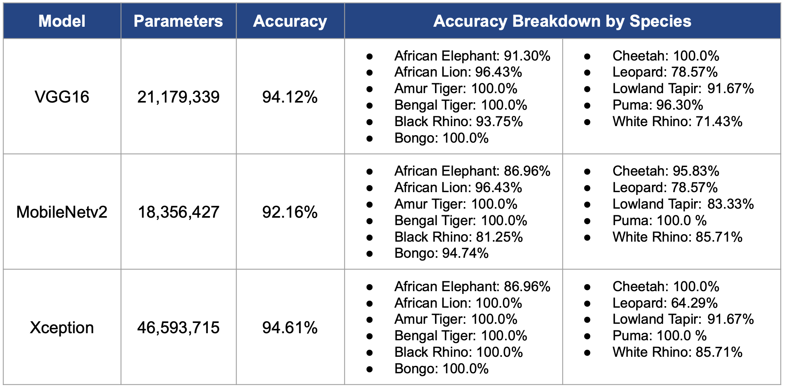
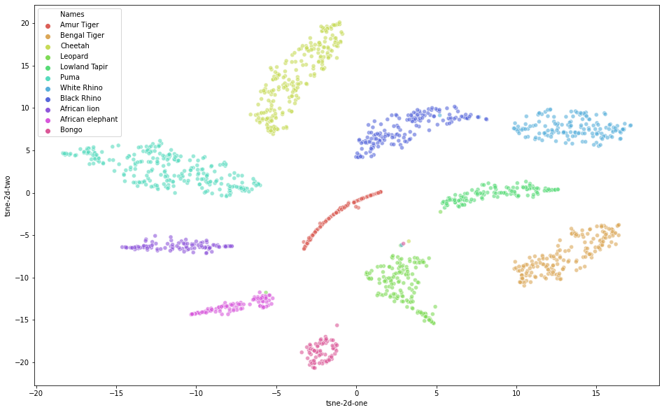
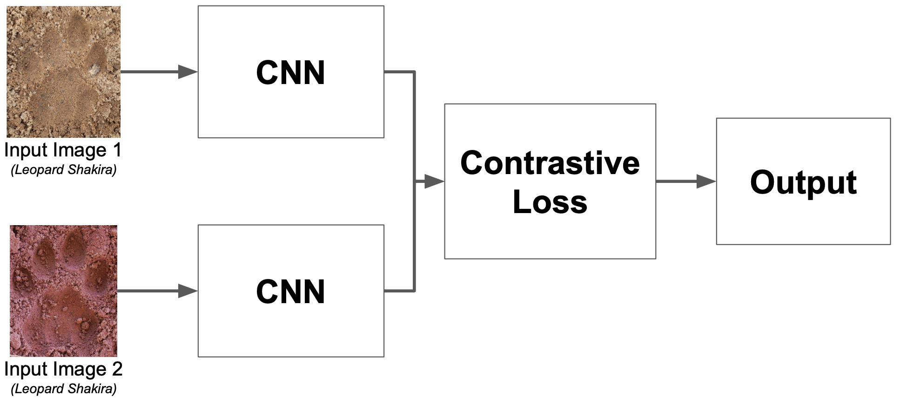
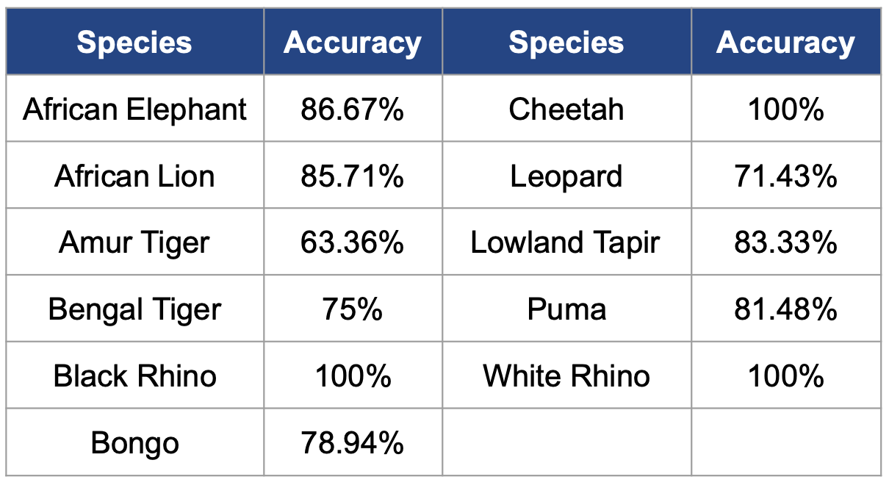
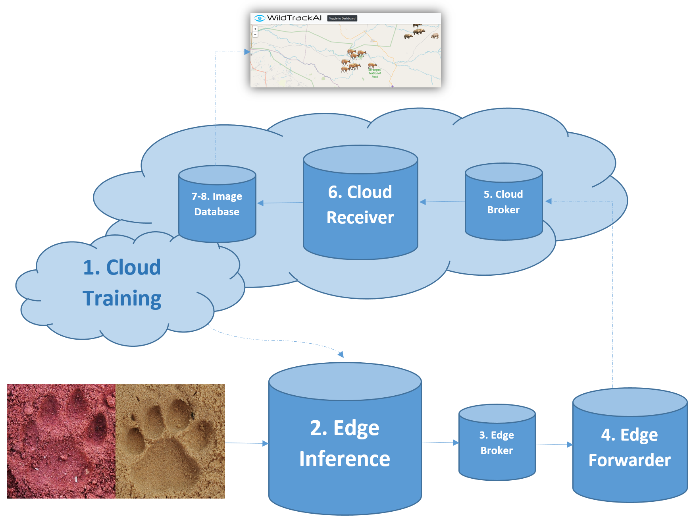

# w251-WildTrackAI
Footprint Identification for Wildlife Monitoring

## 1. Introduction  
  
WildTrack (https://wildtrack.org/) is a non-profit organization that aims to develop and provide non-invasive effective monitoring of endangered species in order to mitigate human wildlife conflicts and prevent illegal poaching.   
Traditional wildlife monitoring techniques rely on fitting of instrumentation to an animal (transmitter on a collar, tag, insert), marking, capture or close visual observation, which have shown to have counterproductive effects on conservation efforts. WildTrack was founded on the premise that monitoring could be made safer and more efficient using non-invasive techniques based on the time-honored tradition of trail and footprint tracking used by indigenous trackers.  
At the heart of WildTrack's methodology is a specialized software FIT (Footprint Identification Technology) based on SAS JMP technology. FIT maintains a  database for animals of various species being tracked, creating a unique profile for each individual based on morphometrics of the footprints. Once set up, researchers can use it to identify movement/ location of known individuals as well as identify and start tracking previously unknown individuals. More information on how FIT works can be found here:
- https://wildtrack.org/wp-content/uploads/2017/03/FIT-Infographic-for-AZA-dw-1.pdf
- https://wildtrack.org/how-fit-works/

### 1.1 Project Goals
At the outset, the goals of this project were two-fold:
1. To identify and analyze WildTrack's current paint points, exploring potential solutions.
2. After narrowing down to a valuable first set of opportunities to go after, implement an end-to-end proof of concept that addresses those opportunities.

### 1.2 WildTrack current pain points and opportunities
This project focused on two main avenues in the overall WildTrack footprint monitoring workflow:
1. **Location of Trails:** Location of new trails and/ or areas to capture new footprint images is a highly  manual exercise involving classic geographic exploration techniques. More recently, Wildtrack has been experimenting with the use of fixed-wing drones for aerial image capture, but identifying trails on the images that these drones generate is still a manual, difficult and unreliable process.
2. **Pre-processing and profiling of footprints:** For a variety of reasons, the way raw images of footprints need to be collected in the field are time consuming (the capture of a footprint entails laying a ruler next to the footprint at a specific position, taking a picture with a camera aligned as perfectly as possible directly above the footprint at a specific height) and once images are properly captured, they still need a fair amount of processing before they are ready to be analyzed by FIT, which requires human labor.  The images need to be well formed and oriented in a certain way, and specific points (called landmarks) on the footprint need to be identified and measured in FIT before they can be used for downstream identification tasks. All in all, setting up FIT for a new area/preserve can take around 2 months per species.
The founders of WildTrack are motivated to see this project apply AI techniques to help streamline the processes and activities listed above.  

### 1.3 Proposed Approach
The proposed approach is to target an ideal solution, recognizing that it is likely beyond the scope of the first phase of this project. So we will identify an initial project scope from within that solution that has value on its own, while serving as a basis for further work.

#### 1.3.1 Ideal Solution
The ideal solution (depicted in Figure 1) is real time identification and tracking  of wildlife by species and individual. Real time implies processing of images taken from a drone/ phone/ other camera as they are captured, with positive identification data being collected and organized centrally. It is dependent on the process being fully automated: i.e. being able to take on all the identification (species, individual) tasks that FIT does today without requiring any manual intervention (example: measurements, landmark identification, etc).  

*Figure 1: Ideal State*

#### 1.3.2 Project Scope
This project uses state of the art Deep Learning techniques (specifically employing Convolutional Neural Networks)  for the Species Classification and Individual Identification tasks described in the previous section. We outline these methods and select the most adequate model to be utilized at the edge, fulfilling requirements to be on-boarded on a portable device and/or drone for inference in real time. We also explore how wide range images captured via drones can be used to further improve the efficacy of Wildlife Tracking.  

Finally, we propose a practical implementation of an end to end solution using these methods on an edge device to collect and capture data saved in the cloud for further processing and model improvement.  

## 2. Overall Solution Architecture
The high level solution approach for this project is depicted in Figure 2.   
  
*Figure 2. Solution Approach at a glance*    
The solution has the following key components:
1. Model Training: Models for Species Classification and Individual Identification, trained in the cloud.
2. Inference on the Edge: The models above are deployable on an edge device (in our case, the Jetson TX2) to run inference on captured images and detect species first and then identify a specific individual within that species.  
3. Cloud Database and web application:  A central aggregator for footprints and associated metadata being captured on various edge devices, with a web-front end to view and further management.

## 3. Data Set and Processing (DAN)
### 3.1 Base Images
- Key stats (total images and breakdown by species/ individual) with examples showing diverse substrate/ print types
- Crop images (incl examples of raw and cropped)

|                     Raw Image                    |                     Cropped Image                    |
|:------------------------------------------------:|:----------------------------------------------------:|
|  |  |

*Figure 3: Sample Raw & Cropped Images of Leopard Shakira*

- Separate into test and train (90-10)
### 3.2 Image Augmentation
- What we tried, why we didn't use it

## 4. Model Development (Jonathan & Bona)
Based on initial research, we decided to start on the Species Classification task by experimenting with common computer vision models pretrained on Imagenet. The intent was to use Species classification to establish a baseline of knowledge on the data set, current state of the art and relative model performance. The modeling approach arrived at what would then be used as the basis for Individual Identification.

### 4.1 Species Classification
We approached species classification as a straightforward image classification task i.e. given an image of a footprint, the model predicts it being one of 11 classes (in the case of the set of species this project focused on). After some research and experimentation on the pretrained models in the Keras applications library (VGG family, Resnet, Inception, Xception, Mobilenet, Densenet), we shortlisted VGG16, Mobilenetv2 and Xception for more exhaustive hyperparameter tuning and comparative study.

#### 4.1.1 Model Evaluation & Comparison (Bona)
We enhanced the models for the three shortlisted pretrained models mentioned above by tweaking the depth of the model and various hyperparameter values such as loss function and optimizer. We then evaluated the models based on the test dataset of 204 footprint images using an accuracy as key performance index of the models in addition to the number of parameters in each model. Detailed information on the models can be found below.

*Figure 4: Model Comparison of 3 Pretrained Models*

As shown in the table, although Xception yielded the highest accuracy, VGG16 was chosen as the final model as the difference in the accuracies between VGG16 and Xception is significantly small compared to the difference in the number of model parameters.

#### 4.1.2 Final Results for Species Classification (Bona)
We looked further into the details of the final model to observe how the model performs in each class of species.

We used t-Distributed Stochastic Neighbor Embedding(t-SNE), a dimensionality reduction technique used to represent high-dimensional dataset in a low-dimensional space of two or three dimensions, to visualize the dataset by species. As shown in *Figure 5*, the data points of the same species tend to cluster together. If the graph is looked at more closely, Leopard and White Rhino have a few data points that lie with other species, which explain their lower accuracies compared to those of other species.

*Figure 5. Species Classification Visualization Using t-SNE*

### 4.2 Individual Identification (Jonathan)
Much of the work we did for Individual Identification was inspired by current state of the art techniques in Facial Recognition. Given a footprint, the identification task requires a way to match the footprint to  a set of reference footprints of known individuals.
There are a few core concepts from facial recognition that we found applicable in this space:  
1. Embedding Vectors : The net result of modeling a footprint is to apply dimensionality reduction to the footprint image and generate a lower dimensional vector for each image such that vectors for footprints of the same individual are "closer together" using a consistent distance metric (example: euclidean distance or cosine similarity) than vectors of footprints of different individuals. We term these vectors "Footprint Embeddings". Identification of an individual is then about finding a reference footprint embedding closest to the one we are trying to identify.    
2. Contrastive Loss Functions: Unlike typical loss functions that evaluate the performance of a model for each input in a data set, contrastive loss functions evaluate the performance of a model across a set (2 or 3 in the scenarios described next) of inputs at a time. The intent is to penalize the model for predicting embedding vectors for the same individual that are farther apart and conversely, predicting embedding vectors for different individuals that are closer together.  

#### 4.2.1 Siamese Network Architecture (Bona)
One of the two neural network architecture that we tried is a Siamese network architecture. A Siamese network is an architecture with two parallel neural networks, each taking a different input, and whose outputs are combined to provide some prediction. In the case of individual identification, two footprint images from the same species are fed into the Siamese network, and the prediction on how likely the given two images are to fall into the same individual is provided by the model. The above information is visually depicted in the following figure.

Before training the model, we prepared the training dataset that can fit into the network by creating all possible combination of two footprint images from every species. We also created the corresponding labels that take a form of binary values - denoted as 0 if the two images are from two different individuals and 1 if the two images are from the same individual. Lastly, we randomly removed the image pairs from different individuals so that we have a balanced dataset - that is, a ratio of 1 same individual image pair : 1 different individual image pair.

We tried building and enhancing both custom model and pretrained model(VGG16). The optimized pretrained model had a high accuracy of 91% on the pairwise mapping prediction; however, the accuracy on the individual class prediction (after converting similarity scores to individual classes) was significantly low, which ranged around 18-30%. Further analysis on finding out why there is a huge gap in the accuracies between the two predictions is not performed due to time constraints. One of the potential factors is that we randomly selected one image from each individual to be compared with test images instead of selecting representative footprint images.

#### 4.2.2 Triplets Loss Approach (Jonathan)
Introduced by Schroldd et al (Google - 2015), this approach creates triplets of input images: an anchor image, one positive (or matching) image (same individual), and one negative (non-matching) example (different individual).

The loss function penalizes the model such that the model learns to reduce the distance between matching examples and increase the distance between non-matching examples.  
The result is a footprint embedding for each image such that images of footprints of the same individual  produce images that have a smaller distances (can be clustered together) to allow verification and discrimination from other individuals.

#### 4.2.2 Training Experimentation and Results (Jonathan)
We started with the model pretrained on the species classification task and then fine tuned it distinctly for each species using the Triplets Approach.
We had to tune hyperparameters differently for each species. Final results are depicted in Table 2.  

### 4.3 Additional Exploration
While not implemented as a part of this project scope, techniques for identification of trails and footprints in wider range images were explored as decribed below.  

#### 4.3.1 Trail Identification
Some research led to a promising approach inspired from detecting rivers from remotely sensed imagery, as trails captured from the relatively high altitude WildTrack wixed-wing drone produces similar images. The goal is the characterization of trails according to their Gaussian-like longitudinal continuity. We also researched some useful pre-processing methods that enhances curvilinear features.
This is a semantic segmentation task so after research and pointers from our professors on U-Net approaches, we explored and propose a semantic segmentation neural network which combines the strenghts of residual learning and U-Net for the next phase based on a research by Zhengxin Zhang and Qingjie Liu for "Road extraction by Deep Residual U-Net".
The data labelling is always a bottleneck for segmentation task, so we will coordinate at an early stage with the WildTrack team to ensure we have usable data for the next phase.

#### 4.4 Footprint Detection (Mike)

## 5. Pipeline (Mike)
### 5.1 Flowchart

### 5.2 Components

The following describes the key components of the pipeline and their functionality. Components 2 through 6 below are “containerized” through Docker to facilitate implementation, and Docker networks are created both on the edge devices and in the cloud to handle communication between the different containers. The pipeline utilizes Eclipse Mosquitto (MQTT) to transfer classified images and their respective attributes using a publish/subscribe model described in more detail below. In the Mosquitto context, the images themselves are transferred as the message payload while the image attributes (date, time, species, individual, classification probability, geographic coordinates, etc.) are transferred via the message topic. Throughout the pipeline, the topic used to identify relevant messages is “WildAI/#” with the hashtag used to represent all subsequent attributes that are appended to the message topic.

1. **Cloud Training**: Following the steps outlined in Section 4. Model Development, the model is trained in the cloud utilizing TensorFlow and Keras through Google Colab. Upon finalizing training, the resulting model weights are written to object storage where they can be accessed and loaded onto an edge device.
2. **Edge Inference**: This container is the heaviest of the containerized pipeline (~11GB) as it requires CUDA to leverage the edge device’s GPU for improved performance as well as TensorFlow and Keras to perform inference. The container accepts new footprint images as the input, preprocesses the images, loads the models generated during the Cloud Training step, and classifies the images first by species and then by individual. Once classification is completed, the image is converted to a byte array and, along with its respective attributes, is published to the Edge Broker.
3. **Edge Broker**: The Edge Broker is a very light container (<10MB) based on Alpine Linux. It simply runs Mosquitto to handle messages published from the Edge Inference container and subscribed to from the Edge Forwarder.
4. **Edge Forwarder**: The Edge Forwarder is also an Alpine Linux container which runs Paho MQTT, a Python client library which implements the MQTT (Mosquitto) protocol. This container consists of two MQTT clients, one which subscribes to messages published to the Edge Broker on topic “WildAI/#” and one which immediately publishes (forwards) those messages to the Cloud Broker.
5. **Cloud Broker**: Identical to the Edge Broker, the Cloud Broker handles messages published from the Edge Forwarder and subscribed to from the Cloud Receiver.
6. **Cloud Receiver**: The Cloud Receiver subscribes to messages published to the Cloud Broker on the topic “WildAI/#”. As the messages were originally published by the Edge Inference container as a byte array, the Cloud Receiver is responsible for writing the message payloads to image files to object storage. The message topics containing the image attributes are written directly into the file name when saving.
7. **Storage**: An S3 storage folder is mounted on the virtual server instance to temporarily house new images that are transferred through the pipeline. Note: this is the same S3 storage utilized to save the latest versions of the model weights.
8. **Image Database**: Once new images are available, a user syncs them and parses their attributes from the file name to an image database for access by the front-end application.
9. **Front End Application**: See Section 5.3.

### 5.3 Web application & Front end

Footprints have inherent characteristics that are temporal and spatial in nature. That is to say, the footprint impression was made at a particular time and at specific coordinates in space. One can imagine a research use-case for tracking the seasonal grazing and roaming patterns of a species. Here we consider the urgency in knowing the number and location of an endangered species for the purpose of conservation. Tagging footprint images with metadata reflecting time and location provide information relevant to a variety of interests and use-cases.

Because of the geospatial features and WildTrack’s mission to non-invasively monitor species movement in locations of interest, we believe including a map as an interface element creates value. The tools commonly used to track footprints include digital cameras, camera-enabled smartphones, and drones supporting high resolution cameras as payload. Many of these tools embed time stamp and location information as metadata in the image file. The drone community commonly utilizes map-based tools for mission planning and assessment. Smartphone photo applications include features for visualizing where a photo was taken on a map. Photos are sequenced based on time as a default visualization setting in both of these uses.

In production, we would seek to leverage time and location metadata read directly from the image file as a component in our pipeline. For the purpose of demonstration, we picked a location familiar to the WildTrack organization and randomly assigned geo coordinates to the image files. As an issue of importance, we are sensitive to the privacy concerns associated with geotagging animals - particularly endangered species. As an unintended consequence of the tracking technology, poachers would also profit from information produced in this application. We see it as ethical and critical to implement security and authentication as components in a production process.

For the purpose of rapidly prototyping a “minimum viable product” that demonstrates front end user capabilities,  we employed the highly accessible utility of a web-based application and integrated a handful of high level application programming interfaces (API) to build a demo-worthy tool.
We built a full stack application (Apache server, Mysql database and Php for the logic) that collects the output from the edge inference pipeline. Images are saved and all information is persisted in the database. The web app front end allows on one hand, for exploration within a table format, with additional functionalities to assign status to a record depending on the confidence level of the inference and other factors. We also created a map based on an open source JavaScript library called Leaflet. Leaflet retrieves tiled web maps from a collaborative mapping project called OpenStreetMaps.

For data input, Leaflet supports an open data standard called GeoJSON. JavaScript Object Notation (JSON) is a popular and lightweight data representation standard. GeoJSON is a JSON subset. As the name suggests, GeoJSON supports the representation of geospatial entities such as geotagged images. Like many map utilities, Leaflet has as a feature in its API the ability to directly read data from a GeoJSON file. Leaflet facilities presenting the geospatial entities as icons on the map.

GeoJSON is extensible in the sense that user-defined properties can be added. Due to the specialized nature of our application, we added properties specific to our task such as the predicted species, the name of the individual, the confidence of the prediction, the sex of the known individual if available, and a link for the footprint image file used to make the prediction. The leaflet API also has the capability to easily create tooltips for icons added to the map interface. We leveraged these tooltips to present a selection of the properties from the GeoJSON to the user.

## 6. Future Steps (Everyone)
- **Object Detection**: The team sees a real opportunity to streamline the image collection and inference process by implementing an object detection system whereby the model could detect footprints from images or videos taken from a further distance vs. closeup images taken at a very specific orientation. Subsequently, we envision an implementation similar to YOLO whereby the model could perform classification in realtime through the camera of a mobile device applying an object detection algorithm. To achieve that, we would work on model enhancement by expanding training data via combination of augmentation and procurement of additional images that aren’t as well curated as our initial set (i.e. imperfect images).
We would also evaluate other pretrained model architectures like MixNet, Efficient Net to further drive down the model footprint without unduly sacrificing accuracy.
We will also work on the semantic segmentation task for trail identifications to alleviate that part of the process.
- **Pipeline Optimization**: With the exception of the "intake" container, which loads the pretrained models and performs inference, the pipeline is very light, with the containers totaling ## MB. However, the intake container does require some additional work to reduce its' size to be more mobile-friendly. This could be achieved through the identification of a more mobile-friendly model, or through reconfiguring a streamlined container that can still perform the necessary functionality.
- Model Enhancement
- Productionalization
The automation of deployments of models to the edge as well as security are paramount aspects for the operationalization but we will as well work closely with the WildTrack team to develop a production grade web application and work on integration into their IT eco system. One important aspect is to move from teh prototype on the Jetson TX2 into a mobile applicaiton to be deployed on mobile phones to be used as edge devices. Along the same lines, working more closely with the drone provider to also deploy an architecture directly on board.
- Real-time Image Augmentation

## 7. Appendix
### 7.1 Note from WildTrack Founders  
  
Zoë Jewell *M.A., M.Sc., Vet. M.B., M.R.C.V.S*  
Sky Alibhai *D.Phil.*  
*Principal Research Associates, JMP software, SAS Institute*  
*Adjunct Faculty, Nicholas School of the Environment, Duke University*  
*Research Associates, University of Technology, Sydney.*  

WildTrack’s mission is to protect endangered species using non-invasive technologies. Our footprint identification technique (FIT) gives us high accuracy in classifying at the species and individual levels, but requires domain expertise to identify good data, and is labour-intensive.  As such, we struggle to process the increasing volumes of data required to mitigate species loss.

We presented Darragh Hanley’s research group with a huge challenge: To introduce automated classification into our system. Footprint images offer several unique AI challenges, for example, the background and object of interest (footprint impression) are effectively the same color/texture and there are no clear boundaries between them. Also, many different variables impact on the footprint quality, resulting in considerable variation between each footprint made by an individual animal.  We presented the team with two different challenges; one was to identify species and the other, to identify individuals from footprint images. In both cases, they came up with very impressive levels of accuracy.

We have decades of experience working with footprints, and in the last 20 years have collaborated with many different academic groups trying to automate elements of our FIT process. **This is the first group with whom real progress has been made!**  Not only do they clearly have very strong and complementary skills, but (refreshingly) they came in with no assumptions, consulted very thoroughly with us about what we hoped to achieve, and made the effort to understand our domain. They approached the problem from our perspective and have at each stage considered how the outputs will integrate to form a practical field-based solution. Their results, achieved in a relatively short period of time, are better than we could possibly have expected and far surpass those of any other team we have worked with.

**Huge kudos go to this team!** We can’t praise their work highly enough and we’re excited to take this project forward together.

### 7.2 Implementation and Setup Details
Details on various code artifacts and implementation can be found in this document .....<insert link to set up doc>

### 7.3  References
1. Koch et al, 2015. Siamese Neural Networks for One-shot Image Recognition (https://www.cs.cmu.edu/~rsalakhu/papers/oneshot1.pdf)
2. Schroff et al. Google (2015). FaceNet: A Unified Embedding for Face Recognition and Clustering (https://arxiv.org/abs/1503.03832)
3. Gu, Aibhai, Jewell et al (2014). Sex Determination of Amur Tigers From Footprints in Snow (https://wildtrack.org/wp-content/uploads/2014/06/Amur-tiger-paper-WSB-2014.pdf)    
